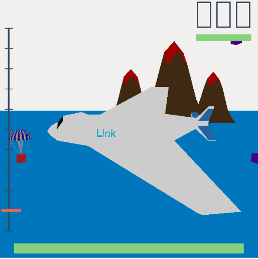

# 3D Fighter Jet Plane Game

You are Link, a fighter plane and your aim is to get the maximum number of points and navigate through checkpoints.



## Requirements

The following will need to be installed:
* GLEW
* GLFW3
* GLM
* Cmake

**Fedora**
```
sudo pkgconf-pkg-config dnf install glew-devel glfw-devel glm-devel cmake pkgconf
```

**Ubuntu**
```
sudo apt install libglew-dev libglfw3-dev libglm-dev cmake pkg-config
```

**Mac**
```
brew install glew glfw glm cmake pkg-config
```

## Running the game

```
$ mkdir build
$ cd build
$ cmake ..
$ make all
$ ./game
```

## Features and Controls

1. The plane can move using the following controls:
* SPACEBAR to accelerate forward
* W to move up
* S to move down
* A to tilt left
* D to tilt right
* Q to turn left
* E to turn right
* Keys 1 to 5 for different views (discussed in the Views section)
* Left click to shoot missiles (only one can be shot at a time)
* Right click to drop bombs (only one can be shot at a time)

2. Dashboard
* The bar at the bottom repesents the fuel bar
* The bar to the left represents the altitude of the plane
* The number display on the top right corner denotes the speed of the plane
* The bar below the speed denotes your health
* A crosshair target is present at the center of the screen in front view

3. Ocean  
Below you will be an ocean – falling in it will cause instant death.

4. Checkpoints  
The checkpoint is indicated by a red arrow pointing to the it below. Your task is to navigate to that checkpoint and destroy the enemy cannon there using missiles and bombs. Destroying it will disappear the checkpoint, a new one will appear at another point and you will gain 50 points. Be careful not to get hit by enemy cannon balls, or it will reduce your health.

5. Smoke rings  
Passing through the smoke ring will result in 10 points.

6. Fuel ups  
Collecting fuel ups will completely refuel your plane.

7. Enemy parachutes  
Enemy parachutes will be falling around you and contact with them at any point leads
to loss of health. Shooting and destroying one will lead to a gain of 20 points.

8. Volcanos  
There are volcanos present – flying anywhere close to them or flying at any height
above them will lead to death.

## Views

There are five different views:

1. Front view: Press 1 to enable cockpit view.
2. Tower view: Press 2 to enable view of the plane as seen by a tower.
3. Follow cam view: Press 3 to enable
4. Top view: Press 4 to enable.
5. Helicopter view: Press 5 to enable camera movement using the mouse along with
zooming using scroll.